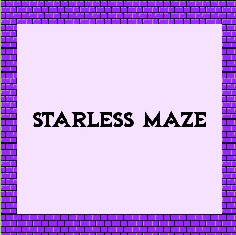
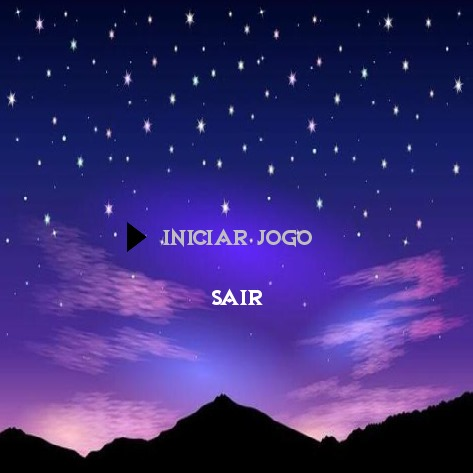
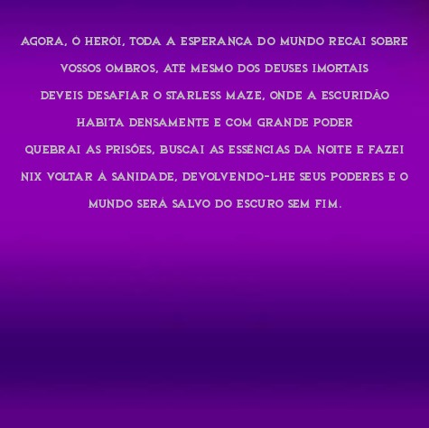
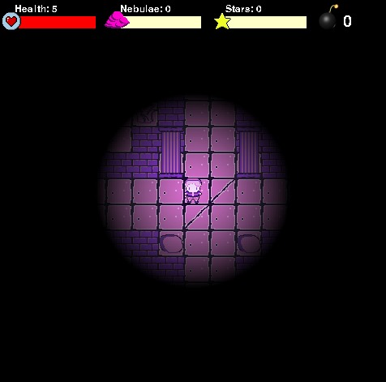
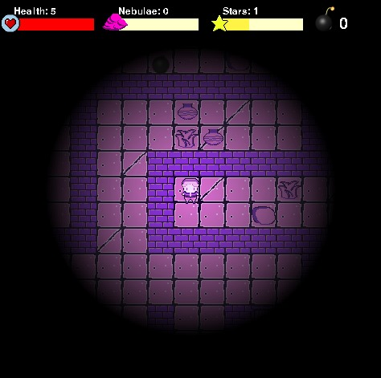
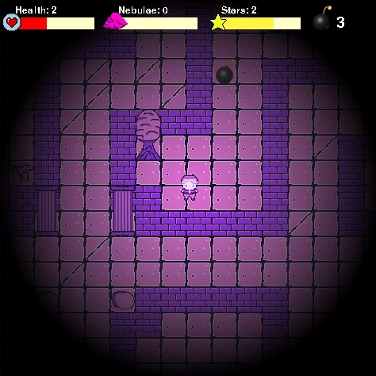
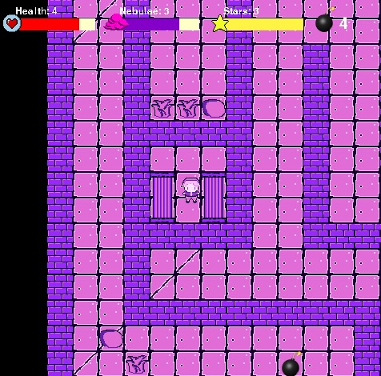
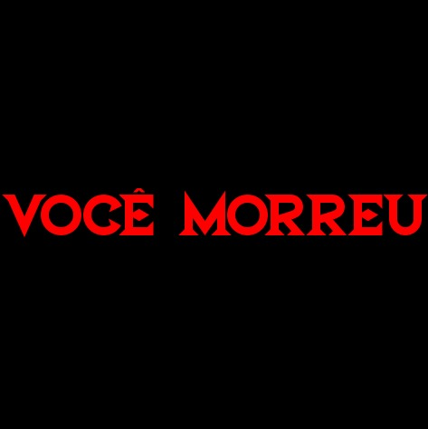
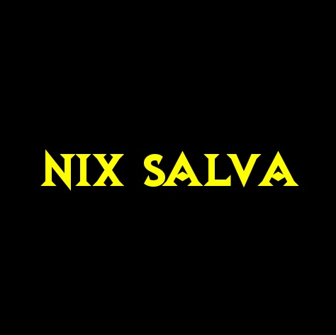

# Starless Maze
Do Caos, do profundo abismo, um ser surgiu dentre as primeiras entidades a existir: **A Noite**. O Cosmo povoa seu interior, e os corpos celestes deitam-se por sobre sua profunda escuridão, percorrendo o vazio e o firmamento, trazendo luz para as trevas e caminho para os perdidos. É **Nix**: a própria noite.

Hipnos, um de seus filhos e deus do sono, certa vez fez o grande Zeus cair em sono profundo. Tudo por causa das artimanhas de Hera. Mas quando Zeus se levantou de seu sono, cheio de cólera, quase lançou Hipnos no oceano para destruí-lo, se não fosse pela proteção de **Nix**, sua mãe. Desse modo Hipnos foi salvo por sua mãe, a Noite, pois é tão poderosa que até o próprio Zeus a teme.

Mas a ira de Zeus por Hipnos nunca se acalmou, pelo contrário, apenas cresceu. Então Zeus, buscando vingança do deus do sono, decide enfraquecer os poderes de **Nix** para que Hipnos ficasse desprotegido, e assim satisfazer seu furor. Por isso, afim de enfraquecer os poderes de **Nix**, Zeus roubou as essências da Noite: as *Estrelas* e as *Nebulosas*. Essas essências ele espalhou e aprisionou num Labirinto, onde nenhum deus poderia entrar, devido a um grande encanto, de modo que a Noite nunca pudesse reaver seus poderes. E aquele foi o *Dia da Ruína* para toda a existência, pois, perdendo as essências da Noite, **Nix** caiu em um grande lapso de loucura, pior que a cólera de Zeus, e o Mundo foi engolido por trevas. Nem o Sol e nem Apolo podiam fazer algo sobre isso.

**"Agora, ó herói, toda a esperança do mundo recai sobre teus ombros, até mesmo dos deuses imortais. Deveis desafiar o *Starless Maze*, onde a escuridão habita densamente e com grande poder quebrai as prisões, buscai as essências da Noite e fazei Nix voltar à sanidade, devolvendo-lhe seus poderes e o mundo será salvo do escuro sem fim."**

## Equipe
| | |  |  |    |    |
|--------------------------------------------------------------------------------------------------------------- | ----------------------------------------------------------------------------------------------------------- | ----------------------------------------------------------------------------------------------------------------- |--------------|----------------|------------    |
|[Felipe Oliveira](https://github.com/feelps-1)                                                                  | [Paulo César](https://github.com/paulo-cesar-pereira)                                                       | [Thaphylla Ayanny](https://github.com/tatudep)                                                                    | [Artur Machado](https://github.com/Artur-Mac)|[Matheus Sobreira](https://github.com/Mhtz-01)|[Mateus Alexandre](https://github.com/Alexslec)|             |

## Objetivos e descrição do jogo
Este é um projeto para a disciplina de Introdução à Programação na Universidade Federal de Pernambuco (UFPE). Neste projeto desenvolvemos um jogo ao qual nomeamos de "Starless Maze" cujo objetivo do jogo é explorar um labirinto e encontrar os itens necessários para libertar o mundo da escuridão, esses itens são as Estrelas e as Nebulosas, ao serem coletadas 3 Estrelas e 4 Nebulosas, o jogo é finalizado libertando o mundo da escuridão. Também temos as bombas para atrapalhar o jogador, pois são coletáveis e reduzem sua vida. As estrelas aumentam o raio de iluminação que o personagem consegue enxergar e as nebulosas recuperam sua vida perdida.

## Organização do nosso desenvolvimento

Para lidar com o desenvolvimento de um programa bem mais complexo do que aqueles feitos nas atividades individuais da disciplina, precisamos nos organizar em grupo.

### Comunicação interna

Além das conversas presenciais nas aulas do CIn, mantivemos contato por aplicativos de mensagens. Além disso, a escrita ou atualização dos códigos eram feitas de modo bem legível e/ou com comentários, para que os outros pudessem acompanhar melhor. Quando toda a explicação de um assunto se fazia necessária, também compartilhávamos conteúdos didáticos.

### Divisão de tarefas entre os membros da equipe:
- *Artur Machado* (aam5): Sprites, detalhamento final e ending;
- *Felipe Santana* (fso2): Movimentação, colisão, estrutura básica;
- *Matheus Sobreira* (mss13): Ending, auxílio no menu, auxílio na concepção do efeito tocha;
- *Matheus Alexandre* (mas12): Lore e posicionamento, adição e barra de coletáveis;
- *Paulo César* (pcnp): Efeito de tocha;
- *Thaphylla Ayanny* (tatp): Menu e Intro do jogo.

### Tecnologias utilizadas:
- *Linguagem de Programação*: Python;
- *Biblioteca ultilizada*: PyGame;
- *Ferramentas*: Git, GitHub, Tiled, Piskel, Visual Studio Code, Gimp, OpenGameArt.og e Inkscape.

### Organização do código:
- *Collectible.py*: define o comportamento dos coletáveis;
- *hud.py*: mostra os contadores;
- *level.py*: é o mapa;
- *lighting.py*: efeito de iluminação da tocha;
- *main.py*: parte para executar o jogo;
- *menu.py*: menu do jogo;
- *player.py*: comportamento do player;
- *settings.py*: configurações gerais do jogo;
- *support.py*: funções de suporte para manipular o csv;
- *tyle.py*: props do mapa.

## Conceitos aprendidos na disciplina e usados no projeto

Condicionais, laços, listas, funções, tuplas e dicionários, conceitos de programação aprendidos durante o curso aparecem em vários lugares do nosso programa. Além de classes, objetos, atributos e métodos, aprendidos nessa fase do projeto. O uso explícito de recursão não se fez necessário.

O uso mais comum foi o de condicionais e laços, além da programação orientada a objetos, aparencendo em quase todos os scripts. Destacamos o uso de funções e listas em support.py, e o uso de dicionários e tuplas em level.py.

## Desafios e erros enfrentados

Lidar com a organização do tempo em um projeto grande como esse, simultaneamente ao que acontecia em outras disciplinas, foi algo novo e dificultoso para muitos de nós. Com o tempo, aliás, fomos nos acostumando.

O versionamento foi algo que precisou ser aprimorado com o tempo, e foi onde podemos ter cometido mais erros, mas ganhávamos experiência a cada uso mais apropriado do GitHub. Outro uso que não tínhamos costume, nem sequer conhecimento, era o de Programação Orientada a Objetos.

Com o aprimoramento, fica mais fácil de perceber as partes do projeto em que cada um tem mais facilidade e habilidade em trabalhar. Mas no início, e sem experiência de outros projetos do tipo, tivemos dificuldade em dividir as tarefas. Era o nosso maior desafio. Depois que cada uma aprendeu mais sobre os assuntos envolvidos, ficou mais fácil de dividir.

## O Jogo em funcionamento

### Prints

### Instruções para a execução do Jogo

Antes de tudo, garanta que você possui um compilador que rode a linguagem de programação Python. Certifique-se também que possua o Python instalado no seu computador, e, após isso, basta  instalar o pygame no seu compilador: caso você esteja no windows, basta abrir o terminal do seu compilador e digitar "pip install pygame" ou "sudo apt-get install python3 *(pode ser outra versão)*" se estiver usando o ubuntu. Tendo tudo isso, é só baixar arquivos disponíveis nesse repositório e executá-los. Por fim, siga as instruções e se divirta:
1. Use as teclas *wasd* para se movimentar na direção que desejar;
2. Colete Estrelas e Nebulosas para conseguir finalizar a história;
3. Evite as bombas para não perder vida e possívelmente morrer.

*As estrelas dão +1 de luz, as nebulosas + 1 de vida, enquanto as bombas - 1 de vida.*
